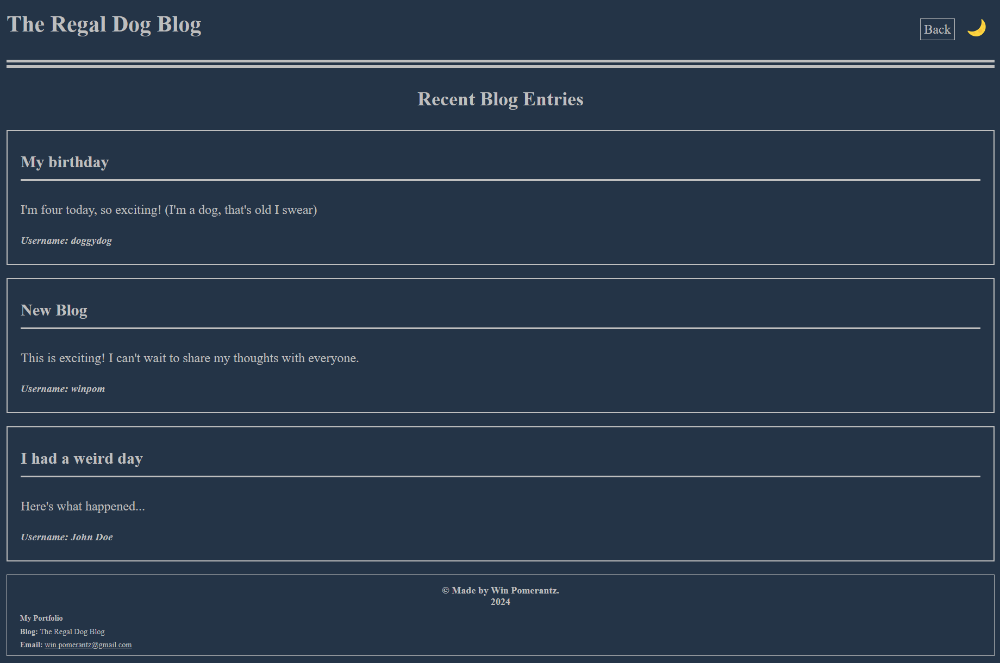
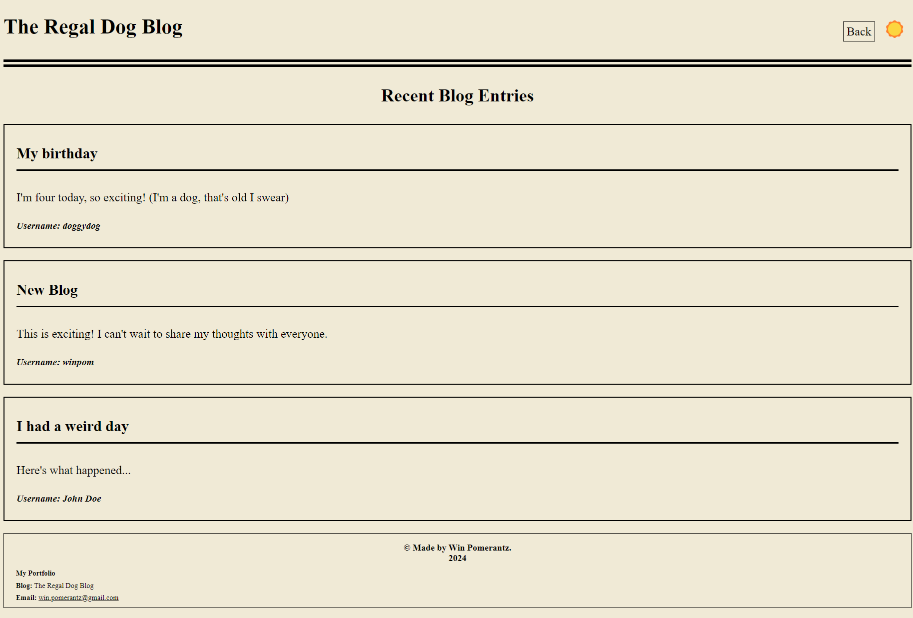

# The Regal Dog Blog

## Description

Welcome to The Regal Dog Blog! This platform is dedicated to regal folks who want to share their experiences, stories, and thoughts on life.

## Features

- **Submit Blog Posts:** Users can submit blog posts by providing their username, a title, and the content of their post.
  

- **View Blog Entries:** Explore the latest blog entries submitted by users.
  

- **Theme Toggle:** Switch between dark and light themes for better readability.
  

## Technologies Used

- HTML5
- CSS3
- JavaScript
- Local Storage

## Installation

1. Clone this repository to your local machine.
2. Open the `index.html` file in your web browser.

## Usage

Explore the blog, submit your own posts, and enjoy reading the experiences shared by fellow dog lovers!

## Contributing

Feedback and contributions are welcome! Fork the repository, make your changes, and submit a pull request.

## License

This project is licensed under the [MIT License](LICENSE).

## Acknowledgments

- Special thanks to [UC Berkeley Coding Bootcamp](https://bootcamp.berkeley.edu/coding/) for providing the resources and support to help me kickstart my coding journey.